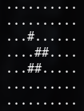

# Game Of Life

Just a fun project, writing simple CLI of Conway's Game of Life in multiple languages



# Compiler/Interpreter used
### Pascal
```
$ fpc
Free Pascal Compiler version 3.2.0 [2020/06/14] for x86_64
Copyright (c) 1993-2020 by Florian Klaempfl and others
```

### Python
```
$ python --version
Python 3.8.5
```

### C++
```
$ g++ --version
g++ (Ubuntu 9.3.0-17ubuntu1~20.04) 9.3.0
Copyright (C) 2019 Free Software Foundation, Inc. 
```

### Haskell
```
$ ghc --version
The Glorious Glasgow Haskell Compilation System, version 8.6.5
```

### Javascript
```
$  node --version
v10.19.0
```

### PHP
```
$ php -v
PHP 7.4.3 (cli) (built: Oct  6 2020 15:47:56) ( NTS )
Copyright (c) The PHP Group
Zend Engine v3.4.0, Copyright (c) Zend Technologies
    with Zend OPcache v7.4.3, Copyright (c), by Zend Technologies
```

### Bash
```
$ bash --version
GNU bash, version 5.0.17(1)-release (x86_64-pc-linux-gnu)
Copyright (C) 2019 Free Software Foundation, Inc.
```

### J
```
ijconsole-9.01
```

### R
```
$ Rscript --version
R scripting front-end version 3.6.3 (2020-02-29)
```
